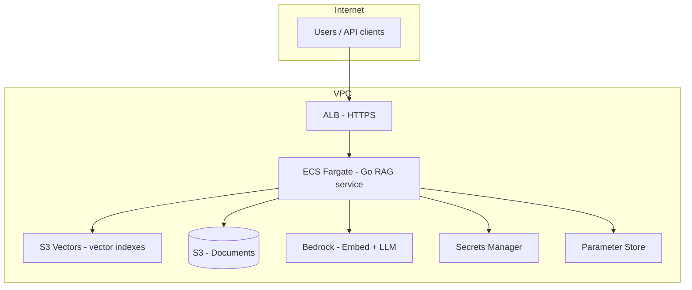
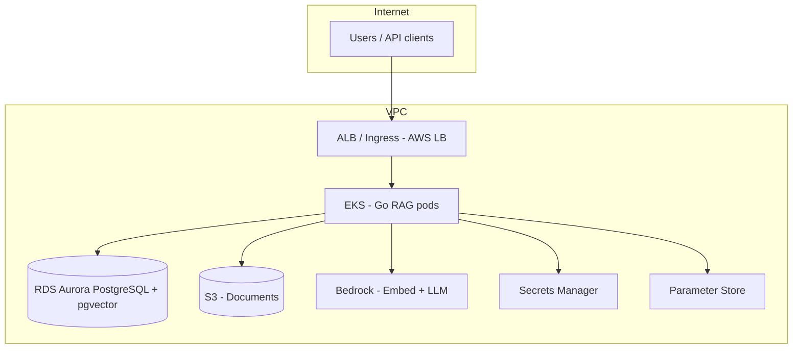
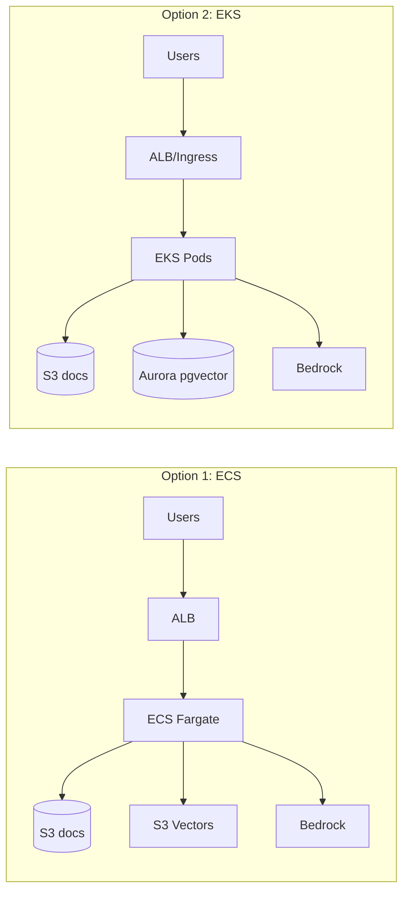

# AWS RAG Implementation Design

## Options
- **Option 1 (ECS):** ECS + ECR + **S3 Vectors** (vector store) + S3 (document storage) + Bedrock.
    - Vector store using [Amazon S3 Vectors](https://aws.amazon.com/s3/features/vectors/): purpose-built vector storage in S3 with native APIs to store and query vectors at scale (cost-optimized; [AWS docs](https://docs.aws.amazon.com/AmazonS3/latest/userguide/s3-vectors.html)). 
- **Option 2 (EKS):** EKS + ECR + **Aurora PostgreSQL with pgvector** (vector store) + S3 (documents) + Bedrock.

## Asumptions
- **Scale:** Very few users; documents = legal PDFs + some video; volume TBD.
- **App:** Exists on-prem; team is willing to adapt the application for the chosen stack.
- **Ops:** Minimal maintenance; focus on development, not infrastructure operations.
- **Target:** Long-term production, keep ops simple.
- **Current on-prem:** Go app + ChatGPT API + PostgreSQL with pgvector.

## High-level RAG components (same for both options)

| Component | Purpose |
|----------|--------|
| **Document storage** | Raw PDFs/docs (S3 in both options) |
| **Embeddings** | Turn text chunks into vectors (Bedrock Titan Embed or similar) |
| **Vector store** | Store vectors + metadata, run similarity search (S3 Vectors or Aurora pgvector) |
| **LLM** | Generate answers from query + retrieved context (Bedrock, replacing ChatGPT API) |
| **App** | Your Go service: ingest, chunk, embed, index, and serve RAG queries |

---

## Option 1: ECS-based architecture

### Conceptual design

- **Compute:** ECS Fargate (or EC2-backed ECS if you prefer).
- **Registry:** ECR for Go app image.
- **Documents:** S3 bucket(s) for raw documents (PDFs, video) and optionally processed chunks.
- **Vector store:** [Amazon S3 Vectors](https://aws.amazon.com/s3/features/vectors/) — vector buckets and vector indexes with dedicated APIs for similarity search; sub-second latency (as low as 100 ms for frequent queries); cost-optimized (AWS cites up to ~90% lower cost for storing/querying vectors).
- **LLM + embeddings:** Bedrock (Titan Embed, and a chat model e.g. Claude).
- **Secrets/Config:** Secrets Manager for API keys; Parameter Store for config.
- **Networking:** VPC, private subnets for ECS; no public IPs for the app.

**Notes**
- **API:** S3 Vectors exposes a dedicated set of API operations (create vector index, put vectors, query vectors, list vectors). IAM uses the **`s3vectors`** namespace for vector buckets/indexes ([AWS docs](https://docs.aws.amazon.com/AmazonS3/latest/userguide/s3-vectors.html)).
- **Go SDK:** AWS SDK for Go v2 includes the **`s3vectors`** client ([`github.com/aws/aws-sdk-go-v2/service/s3vectors`](https://pkg.go.dev/github.com/aws/aws-sdk-go-v2/service/s3vectors)), so the app can create indexes, ingest vectors, and run similarity queries (`QueryVectors`) without extra infrastructure.
- **Access:** Grant the ECS task role permissions for the S3 Vectors bucket and indexes (e.g. `s3vectors:CreateVectorIndex`, `s3vectors:PutVectors`, `s3vectors:QueryVectors`). Also note quet no dedicated VPC endpoint is required for S3 Vectors as VPC endpoint for S3/API calls applies.

S3 Vectors is a good fit for “few users” and “infrequent query” workloads; it is optimized for cost and scale (e.g. up to 2B vectors per index, 10,000 indexes per bucket) with sub-second query performance.

### Diagram in Mermaid

### Summary for Infrastructure
- Application Load Balancer for entry point to ECS task/service
- ECS Fargate: 1 task, single AZ, private subnets
- ECR: one repo for the Go image (or GitHub Registry)
- S3: one bucket for documents; one **vector bucket** (S3 Vectors) with at least one vector index (dimensions, distance metric).
- Bedrock: enable Titan Embed + one chat model
- VPC endpoits for S3 and Bedrock endpoint with IAM
- Go app: use [AWS SDK for Go v2 `s3vectors`](https://pkg.go.dev/github.com/aws/aws-sdk-go-v2/service/s3vectors) for create index, put vectors, query vectors.

## Option 2: EKS

### Conceptual design

- **Compute:** EKS cluster; your Go app runs as Deployment(s); same image in ECR.
- **Documents:** S3 (same as Option 1).
- **Vector store:** **Aurora PostgreSQL with pgvector**
- **LLM + embeddings:** Bedrock (same as Option 1).
- **Secrets:** Secrets Manager + CSI driver or External Secrets; Parameter Store or ConfigMaps.

### Diagram in Mermaid

### Summary for Infrastructure

- EKS: one cluster in auto mode
- ECR: one repo.
- S3: one bucket.
- Aurora PorgreSQL + pgvector.
- Bedrock:
- Ingress: AWS Load Balancer Controller 
- IRSA for permissions
- Endpoints for Bedrock and S3

---

## Comparison

### ECS

- Summary: ECS + ECR + S3 (documents) + **S3 Vectors** (vector store) + Bedrock is a coherent, fully managed RAG stack. [Amazon S3 Vectors](https://aws.amazon.com/s3/features/vectors/) provides native vector storage and similarity query APIs; the Go app on ECS uses the [AWS SDK for Go v2 `s3vectors`](https://pkg.go.dev/github.com/aws/aws-sdk-go-v2/service/s3vectors) client with the ECS task IAM role 
- **Pros:** Simpler than Kubernetes; fewer moving parts; Fargate reduces node management; S3 Vectors is cost-optimized (AWS cites up to ~90% lower cost for vector storage/query); no separate vector DB to operate.
- **Cons:** The on-prem app uses PostgreSQL + pgvector, so you must adapt the Go app to use S3 Vectors APIs (create index, put vectors, query vectors) instead of pgvector SQL.

### Option 2 (EKS + Aurora pgvector)

- **Valid:** EKS + ECR + S3 + **Aurora PostgreSQL with pgvector** + Bedrock is coherent.
- **Pros:** Minimal app change — same pgvector SQL/API as on-prem; one DB for metadata + vectors; familiar stack if you already use PostgreSQL.
- **Cons:** Higher ops and cognitive load (Kubernetes control plane, node upgrades, networking, RBAC); fixed EKS control plane cost; Aurora is more expensive than S3 Vectors for vector storage at scale.

### Vector store choice (S3 Vectors vs Aurora pgvector)

- **S3 Vectors:** Purpose-built vector storage in S3; dedicated APIs; sub-second query latency (as low as 100 ms); cost-optimized; ideal for infrequent-query and cost-sensitive workloads. Requires app changes (Go SDK for `s3vectors`).
- **Aurora pgvector:** Same API as your current on-prem (PostgreSQL + pgvector); no app change for the vector layer; good for “lift and shift” and teams that prefer SQL. Higher ops (RDS) and typically higher cost for large vector datasets than S3 Vectors.

---

## Comparison: technical complexity

| Aspect | Option 1 (ECS) | Option 2 (EKS) |
|--------|----------------|----------------|
| **Compute abstraction** | Tasks + services; no K8s API | Pods, Deployments, Services, Ingress |
| **Networking** | ALB + target groups; straightforward | Ingress controller, CNI, possible service mesh |
| **Scaling** | ECS Service Auto Scaling | HPA + Cluster Autoscaler (or Fargate profiles) |
| **Secrets** | Task role + Secrets Manager / SSM | IRSA + Secrets Manager; CSI or External Secrets |
| **Upgrades** | ECS agent + new task definitions | K8s version + node AMIs / Fargate |
| **Learning curve** | Lower if no K8s background | Higher; more concepts and YAML |
| **Operational burden** | Lower | Higher (control plane, nodes, add-ons) |

**Verdict:** Option 1 is **less complex** unless you already run Kubernetes and want consistency with other clusters.

---

## Comparison: cost (order of magnitude)

Rough monthly ranges for a **small production** setup (single region, low–medium traffic). Prices are indicative and region-dependent.

| Component | Option 1 (ECS) | Option 2 (EKS) |
|-----------|----------------|----------------|
| **Compute** | Fargate ~0.5–2 vCPU, 1–4 GB → ~$30–120 | EKS control plane $73 + 2 nodes ~$70–150 or Fargate ~$50–130 |
| **ECR** | ~$5–10 | ~$5–10 |
| **S3** | ~$5–20 (depends on volume) | ~$5–20 |
| **Vector store** | S3 Vectors (cost-optimized; pay per use; [pricing](https://aws.amazon.com/s3/pricing/)) — typically lower than OpenSearch/Aurora for vector storage | Aurora pgvector ~$80–200 (Serverless v2 min) |
| **Bedrock** | Same usage-based (tokens) | Same |
| **NAT/LB** | ALB ~$20; NAT ~$32+ | Similar |
| **Total (ballpark)** | **~$150–350** + Bedrock usage | **~$250–500** + Bedrock usage |

- **Few users, long-term production:** Option 1 (ECS + S3 Vectors) is typically **lower cost** (no EKS control plane; S3 Vectors is cost-optimized). Option 2 has a fixed EKS control plane cost (~$73/mo) plus Aurora.
- **At scale (many vectors):** S3 Vectors is designed for cost-effective large vector datasets; Aurora can be more expensive for very large vector stores.

---

## Summary and recommendation

Given **very few users**, **minimal maintenance**, **long-term production**, and **willingness to adapt the app**:

- **Option 1 (ECS + S3 Vectors + S3 + Bedrock)** is **recommended.**  
  - **Lower ops:** No Kubernetes; Fargate is fully managed; S3 Vectors is fully managed (no vector DB to operate).  
  - **Lower cost:** No EKS control plane; S3 Vectors is cost-optimized for vector storage/query.  
  - **Trade-off:** The Go app must be adapted to use the S3 Vectors API (AWS SDK for Go v2 `s3vectors`) instead of pgvector SQL.  

- **Option 2 (EKS + Aurora pgvector + S3 + Bedrock)** is **reasonable** if you prefer **zero app change** for the vector layer (keep pgvector) and are willing to operate EKS and Aurora. Expect higher ops and baseline cost.

**Bare minimum for both:**  
One compute layer (ECS or EKS), ECR, one S3 bucket for documents, one vector store (S3 Vectors or Aurora pgvector), Bedrock for embeddings and LLM. For production, add ALB, private subnets, and proper IAM and secrets.

---

## Bare minimum vs best practice (checklist)

| Component | Bare minimum (PoC) | Best practice (production) |
|-----------|--------------------|----------------------------|
| **Compute** | 1 ECS task or small EKS node group, single AZ | Multi-AZ, Auto Scaling, health checks |
| **Load balancer** | Omit (direct task/node access or port-forward) | ALB with HTTPS, WAF optional |
| **Networking** | Public subnets or single NAT | Private subnets, NAT Gateway, VPC endpoints for Bedrock/S3 |
| **Vector store** | S3 Vectors (one vector bucket + index) or Aurora Serverless v2 min + pgvector | Multi-AZ where applicable; backups; monitoring |
| **Secrets** | Env vars or single secret in Secrets Manager | Secrets Manager + IAM roles, no secrets in task def/pod spec |
| **Registry** | Single ECR repo, no lifecycle policy | ECR with lifecycle, image scanning |
| **Observability** | CloudWatch logs only | Logs + metrics + alarms; X-Ray optional |
| **Bedrock** | Public endpoint (IAM only) | VPC endpoint (PrivateLink) so traffic stays in AWS network |

---

## Side-by-side architecture (Mermaid)

---

**References**
- [Amazon S3 Vectors](https://aws.amazon.com/s3/features/vectors/) — product overview  
- [Working with S3 Vectors and vector buckets](https://docs.aws.amazon.com/AmazonS3/latest/userguide/s3-vectors.html) — user guide  
- [AWS SDK for Go v2 — s3vectors](https://pkg.go.dev/github.com/aws/aws-sdk-go-v2/service/s3vectors) — Go client for S3 Vectors
