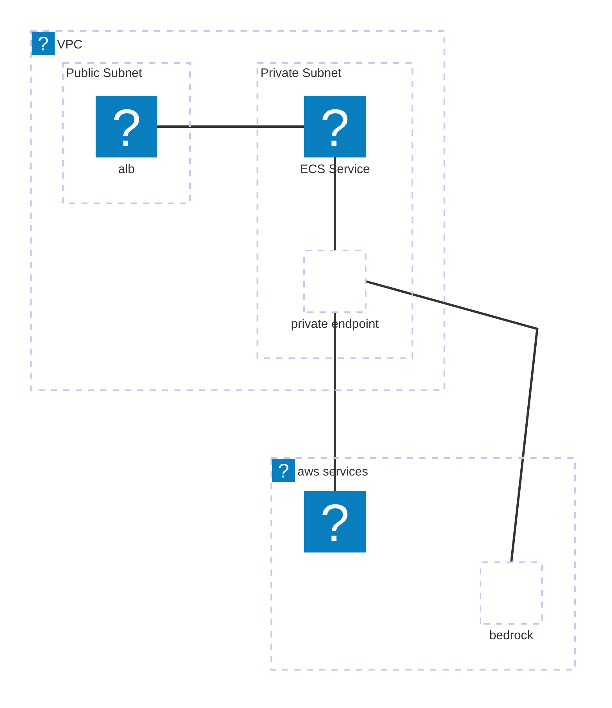

```mermaid
architecture-beta
  group vpc(logos:aws-vpc)[VPC]
  group private_subnet[Private Subnet] in vpc
  group public_subnet[Public Subnet] in vpc
  group aws_services(logos:aws)[aws services]

  service alb(logos:logos:aws)[alb] in public_subnet
  service ecs_service(logos:aws-ecs)[ECS Service] in private_subnet
  service private_endpoint[private endpoint] in private_subnet
  service s3(logos:aws-s3) in aws_services
  service aws_bedrock[bedrock] in aws_services

  alb:R -- L:ecs_service
  ecs_service:B -- T:private_endpoint
  private_endpoint:R -- T:aws_bedrock
  private_endpoint:B -- T:s3 
```